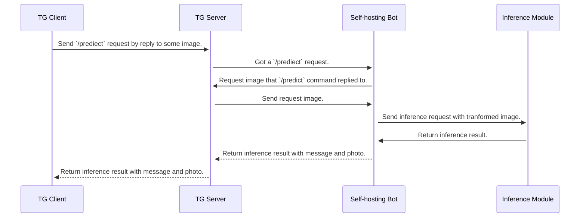

# telegram-dl-bot-example

## Introduction
This is an example workflow of building a telegram DL inference bot. 
You can implement this bot with your bot token and do inference using mnist dataset.

## Prefilght check

- [ ] Get the Bot token from telegram bot father([link](https://t.me/botfather)).
- [ ] Configure you token by changing the setting in `config.ini`.

## Installation
Run this code before you install the dependencies using following command:
```
pip3 install -r requirement.txt
```

## Run bot
You may run this bot by using following command:
```
python3 main.py
```
And feel free to interupt it using `ctrl + c`.

## Structure of Inference workflow


